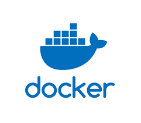
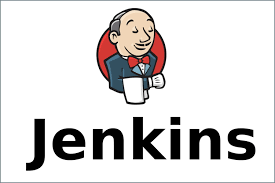
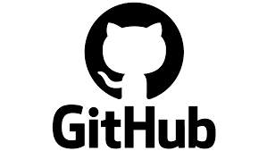
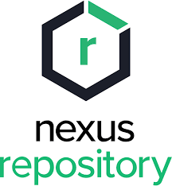
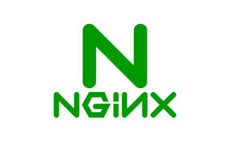
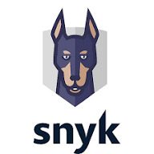

# CI/CD Infrastructure Pipeline

A comprehensive, containerized CI/CD infrastructure built with Docker, Jenkins, and modern DevOps tools. This project provides a complete solution for continuous integration, code quality analysis, security scanning, artifact management, and deployment automation.

## 🏗️ Architecture Overview

This CI/CD pipeline orchestrates multi-platform builds (Linux & Windows), automated testing, code quality analysis, security vulnerability scanning, and artifact management through a unified interface.

```
┌─────────────┐       ┌──────────────┐       ┌─────────────────┐
│   GitHub    │◄─────►│   Jenkins    │◄─────►│  Docker Agents  │
│  (Source)   │       │  (Orchestr.) │       │ (Linux/Windows) │
└─────────────┘       └──────────────┘       └─────────────────┘
                             │
        ┌────────────────────┼────────────────────┐
        │                    │                    │
    ┌───▼────┐         ┌─────▼──┐          ┌────▼────┐
    │ Nexus  │         │ Sonar  │          │  SMTP   │
    │ (Repo) │         │(Quality)│         │ (Email) │
    └────────┘         └────────┘          └─────────┘
        │                    │
        └────────────────────┼────────────────┐
                             │                │
                         ┌───▼────────────────▼────┐
                         │   Nginx Reverse Proxy   │
                         │ (SSL/TLS Termination)   │
                         └────────────────────────┘
```

## 🛠️ Technologies Used

| Technology | Version | Purpose |
|-----------|---------|---------|
| **Docker** | Latest | Container orchestration and deployment |
| **Jenkins** | Latest | CI/CD pipeline automation |
| **GitHub** | - | Version control & source code management |
| **Nexus** | Latest | Artifact repository management |
| **SonarQube** | Latest | Code quality & technical debt analysis |
| **Nginx** | Latest | Reverse proxy & SSL/TLS termination |
| **Snyk** | Latest | Vulnerability scanning & security analysis |
| **Python** | 3.x | SMTP server & email automation |

### Technology Icons

<table>
  <tr>
    <td align="center">
      
      <p><strong>Docker</strong></p>
    </td>
    <td align="center">
      
      <p><strong>Jenkins</strong></p>
    </td>
    <td align="center">
      
      <p><strong>GitHub</strong></p>
    </td>
    <td align="center">
      
      <p><strong>Nexus</strong></p>
    </td>
  </tr>
  <tr>
    <td align="center">
      
      <p><strong>SonarQube</strong></p>
    </td>
    <td align="center">
      
      <p><strong>Nginx</strong></p>
    </td>
    <td align="center">
      
      <p><strong>JIRA</strong></p>
    </td>
    <td align="center">
      
      <p><strong>Snyk</strong></p>      
    </td>
  </tr>
</table>

## 📋 Core Services

### 1. **Jenkins** - CI/CD Orchestration
- Multi-platform build support (Linux & Windows)
- Parallel pipeline execution
- Distributed agent architecture
- WebSocket communication for agent connectivity
- Docker-based execution environment

### 2. **SonarQube** - Code Quality Analysis
- Static code analysis (SCA)
- Technical debt calculation
- Code coverage measurement
- Security hotspot detection
- Multi-language support

### 3. **Nexus** - Artifact Repository
- Maven/Java artifact management
- Dependency management
- Build artifact versioning
- Package distribution

### 4. **Nginx** - Reverse Proxy
- SSL/TLS termination with certificates
- Request routing
- Load balancing
- Security headers
- HTTPS enforcement

### 5. **SMTP Server** - Email Services
- Automated email notifications
- Bulk email distribution
- HTML email support
- CSV-based recipient management
- AWS EC2 deployment ready

### 6. **Docker Agents** - Distributed Build Execution
- **Linux Agent**: Bash-based build execution
- **Windows Agent**: PowerShell-based build execution
- WebSocket communication protocol
- Lightweight containerized environments

## 🔒 Security Analysis with Snyk

This project integrates **Snyk** for comprehensive vulnerability scanning and security analysis:

### Key Security Features:

**Vulnerability Scanning**
- Real-time dependency scanning
- OWASP Top 10 detection
- Container image scanning
- Infrastructure-as-Code (IaC) scanning

**Supported Scanners**
```
├── SCA (Software Composition Analysis)
│   ├── Open source dependency vulnerabilities
│   ├── License compliance checking
│   └── Dependency updates and patches
├── Container Security
│   ├── Docker image scanning
│   ├── Base OS vulnerabilities
│   └── Runtime security
├── IaC Security
│   ├── Dockerfile security analysis
│   ├── Docker-compose validation
│   └── Configuration best practices
└── Code Security
    ├── Application code scanning
    ├── Supply chain security
    └── Policy enforcement
```

### Integration Points:

**1. CI/CD Pipeline Integration**
```bash
# Scan on each commit
snyk test --severity-threshold=high

# Monitor continuously
snyk monitor

# Generate reports
snyk test --json > vulnerability-report.json
```

**2. Dockerfile Security**
```bash
# Scan Docker images
snyk container test my-image:latest

# Fix vulnerable base images
snyk container fix my-image:latest
```

**3. Infrastructure Scanning**
```bash
# Scan docker-compose files
snyk iac test docker-compose.yaml

# Test Dockerfiles
snyk iac test Dockerfile
```

### Dashboard & Reporting:
- Real-time vulnerability tracking
- Remediation guidance
- License risk assessment
- Trending security insights
- Priority scoring and recommendations

## 📦 Project Structure

```
.
├── docker-compose.yaml          # Main orchestration file
├── main/                         # Main application
│   └── Dockerfile
├── agents/                       # Build agents
│   ├── linux/
│   │   ├── Dockerfile
│   │   └── start-agent.sh
│   └── windows/
│       ├── Dockerfile
│       ├── Dockerfile.windows
│       └── start_agent.bat
├── proxy/                        # Nginx reverse proxy
│   ├── Dockerfile
│   ├── nginx.conf
│   ├── openssl.cnf
│   └── certs.sh
├── smtp/                         # Email server
│   ├── Dockerfile
│   ├── smtp_server/
│   │   ├── send_email.py
│   │   ├── bulk_send.py
│   │   ├── test_smtp.py
│   │   └── docker-compose.yml
│   └── requirements.txt
├── img/                          # Technology logos
└── README.md                     # This file
```

## 🚀 Quick Start

### Prerequisites
- Docker & Docker Compose
- Git
- 8GB+ RAM
- Ports: 80, 443, 8080, 8081, 9000, 25, 587 available

### 1. Clone Repository
```bash
git clone https://github.com/your-org/ci-cd-jenkins.git
cd ci-cd-jenkins
```

### 2. Configure Certificates (Optional)
```bash
cd proxy
bash certs.sh
cd ..
```

### 3. Start Services
```bash
docker-compose up -d
```

### 4. Verify Deployment
```bash
docker-compose ps
```

### 5. Access Services
- **Jenkins**: https://localhost (or your domain)
- **SonarQube**: https://localhost/sonarqube
- **Nexus**: https://localhost/nexus
- **Health Check**: https://localhost/health

## 📖 Documentation

- [Jenkins Configuration](./README.md) - Jenkins setup and agent configuration
- [Email Sending Guide](./smtp/smtp_server/EMAIL_SENDING.md) - SMTP server usage
- [EC2 Deployment](./smtp/smtp_server/DEPLOY_TO_EC2.md) - AWS deployment instructions
- [Security Groups Setup](./smtp/smtp_server/SECURITY_GROUP_PORTS.md) - AWS security configuration

## 🔧 Configuration

### Jenkins Agents

**Connect Docker Agent (Linux):**
```bash
docker exec -it ci_cd_jenkins_linux_agent curl -sO \
  http://ci_cd_jenkins:8080/jnlpJars/agent.jar

docker exec -it ci_cd_jenkins_linux_agent java -jar agent.jar \
  -url http://[JENKINS_URL]:8080/ \
  -secret [SECRET_KEY] \
  -name "Docker-Agent-Linux" \
  -webSocket \
  -workDir "/home/jenkins/agent"
```

**Connect Docker Agent (Windows):**
```powershell
docker exec -it ci_cd_jenkins_windows_agent cmd /c ^
  certutil -urlcache -split -f http://[JENKINS_URL]:8080/jnlpJars/agent.jar

docker exec -it ci_cd_jenkins_windows_agent java -jar agent.jar ^
  -url http://[JENKINS_URL]:8080/ ^
  -secret [SECRET_KEY] ^
  -name "Docker-Agent-Windows" ^
  -webSocket ^
  -workDir "C:\jenkins\agent"
```

### Environment Variables

Create a `.env` file for SMTP configuration:
```env
SMTP_SERVER=your-server.com
SMTP_PORT=587
SMTP_USERNAME=admin
SMTP_PASSWORD=secure_password
FROM_EMAIL=noreply@your-domain.com
```

### SSL/TLS Certificates

**Enable HTTPS:**
1. Generate certificates using `proxy/certs.sh`
2. Import CA certificate to your trusted store
3. Update `/etc/hosts` for local domain resolution
4. Restart Nginx: `docker-compose restart nginx-proxy`

## 🔐 Security Best Practices

✅ **Implemented:**
- SSL/TLS encryption (Nginx termination)
- Secret management via environment variables
- Docker network isolation
- Image scanning with Snyk
- SonarQube security hotspot detection

⚠️ **Recommendations:**
- Enable two-factor authentication on all services
- Regularly update Docker images
- Implement rate limiting on sensitive endpoints
- Use secrets management (HashiCorp Vault, AWS Secrets Manager)
- Enable audit logging on Jenkins
- Run Snyk security scans in CI/CD pipeline

## 🧪 Testing & Quality Assurance

**Code Quality:**
```bash
# Run SonarQube analysis
docker-compose exec sonarqube /opt/sonarqube/bin/linux-x86-64/sonar.sh
```

**Vulnerability Scanning:**
```bash
# Scan with Snyk
snyk test --all-projects

# Scan containers
snyk container test ci_cd_jenkins:latest

# Generate HTML report
snyk test --json | snyk-to-html -o report.html
```

**SMTP Testing:**
```bash
cd smtp/smtp_server
python test_smtp.py
```

## 🐳 Docker Compose Services

| Service | Container | Ports | Status |
|---------|-----------|-------|--------|
| Nginx | ci_cd_nginx-proxy | 80, 443 | Active |
| Jenkins | ci_cd_jenkins | 8080, 50000 | Active |
| SonarQube | ci_cd_sonarqube | 9000 | Active |
| Nexus | ci_cd_nexus | 8081 | Active |
| Linux Agent | ci_cd_jenkins_linux_agent | - | On Demand |
| Windows Agent | ci_cd_jenkins_windows_agent | - | On Demand |

## 📊 Deployment Pipeline Flow

1. **Developer** commits code to GitHub
2. **GitHub Webhook** triggers Jenkins job
3. **Jenkins** collects build parameters (platforms, options)
4. **Parallel Stages** execute on respective agents:
   - Linux: Load deps → Build → Unit Tests → Package
   - Windows: Load deps → Build → Unit Tests → Package
5. **SonarQube** analyzes code quality & security
6. **Nexus** stores build artifacts
7. **Snyk** scans for vulnerabilities
8. **Email Notifications** sent via SMTP server
9. **Deployment** to production environment

## 🐛 Troubleshooting

### Agent Connection Issues
```bash
# Check agent logs
docker logs ci_cd_jenkins_linux_agent

# Verify network connectivity
docker exec ci_cd_jenkins_linux_agent ping ci_cd_jenkins
```

### Certificate Warnings
```bash
# Import CA certificate to Windows Trust Store (see note.txt)
# Or access via IP address to bypass HTTPS warnings
```

### SMTP Port Blocked on AWS
- AWS blocks outbound port 25 by default
- Use port 587 (TLS) instead
- Request port 25 unblock through AWS Support
- Or use AWS SES service

## 🤝 Contributing

1. Fork the repository
2. Create a feature branch (`git checkout -b feature/improvement`)
3. Commit changes (`git commit -m 'Add improvements'`)
4. Push to branch (`git push origin feature/improvement`)
5. Open a Pull Request

## 📝 License

This project is licensed under the MIT License - see the [LICENSE](LICENSE) file for details.

## 📞 Support

For issues, questions, or suggestions:
- Open an issue on GitHub
- Check the documentation in related `.md` files
- Review Docker logs: `docker-compose logs [service-name]`
- Check Jenkins console output for build errors

## 🎯 Roadmap

- [ ] Kubernetes migration
- [ ] Helm charts for K8s deployment
- [ ] Advanced Snyk policy enforcement
- [ ] GitOps integration (ArgoCD)
- [ ] Automated dependency updates
- [ ] SLSA provenance generation
- [ ] Runtime security monitoring
- [ ] Multi-region deployment

---

**Last Updated:** 2026-06-17  
**Maintainer:** DevOps Team
